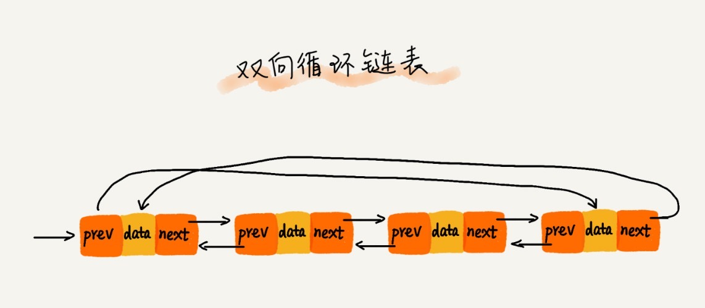

# 7 链表上篇
## 缓存

缓存是一种提高数据读取速度的技术。CPU 缓存是常见的硬件缓存，浏览器缓存是常见的软件缓存。缓存淘汰策略有：

* FIFO，first in, first out，先进先出
* LFU，least frequently used，最少使用
* LRU，least recently used，最近最少使用

## 链表

> 链表和数组是两种非常基础、非常常用的数据结构。

链表是一种线性表，它不需要一块连续的内存空间，它通过指针将一组零散的内存块串联起来使用。链表有以下几种。

* 单链表
* 循环链表
* 双向链表
* 双向循环链表

涉及的术语有：

* 结点：每一个零散的内存块称为结点。
* 前驱指针：如果结点除了存储数据外，还记录了上个结点的地址，那么记录上个结点地址的指针称为前驱指针。
* 后继指针

### 链表的特点

* 线性表
* 内存空间不必连续
* 不支持随机访问
* 遍历的时间复杂度为 O(n)
* 单纯插入或删除结点的时间复杂度为 O(1)

插入删除结点，都是改变相邻结点的指针，因此时间复杂度为 O(1)。与数组相比，链表插入或删除结点都不需要进行数据的迁移。

## 单链表

* 头结点用于记录链表的基地址：用于遍历整条链表。
* 头结点的作用并不是用于随机访问，况且链表并不支持随机访问。
* 尾结点的 next 后继指针为 `null`：用于表示链表上的最后一个结点。

## 循环链表

* 循环链表是一种特殊的单链表。
* 尾结点的 next 后继指针不为 `null`，而是指向头结点。
* 适合于数据具有环形结构特点的场景，比如 [约瑟夫问题](https://zh.wikipedia.org/wiki/%E7%BA%A6%E7%91%9F%E5%A4%AB%E6%96%AF%E9%97%AE%E9%A2%98)。

## 双向链表

* 每个结点都有一个前驱指针 prev，来指向前一个结点；其中，头结点的 prev 指针为 `null`。
* 每个结点都有一个后继指针 next，来指向后一个结点；其中，尾结点的 next 指针为 `null`。
* 支持在 O(1) 复杂度找到前驱结点，这让双向链表在某些情况下的插入、删除操作比单链表更加简单高效。

## 双向循环链表

* 双向循环链表是一种特殊的双向链表。
* 头结点的 prev 指针指向尾结点。
* 尾结点的 next 指针指向头结点。

## 链表插入删除结点的分析

删除结点的情况

* 删除"值等于给定值"的结点
* 删除给定指针指向的结点

### 删除值等于给定值的结点

单纯的删除结点操作的时间复杂度为 O(1)，但是为了找到"值等于给定值"的结点，在单向链表和双向链表中，都必须进行遍历比较，而遍历的时间复杂度为 O(n)。

### 删除给定指针指向的结点

删除给定指针指向的结点，必须知道其前驱结点。对于单链表，必须遍历才能得到 `p->next=q`，所以时间复杂度为 O(n)；在双向链表中，找到前驱结点的时间复杂度为 O(1)，所以最终的时间复杂度为 O(1)。

### 双向链表 VS 单链表

双向链表要比单链表更费内存，但在删除给定指针指向的结点、在给定指针指向的结点前插入新结点、在有序链表中按值查询等方面，双向链表都要比单链表高效。

这是一种空间换时间的设计思想。

## 数组 VS 链表

* 数组使用的是连续内存空间，对 CPU 缓存是友好的；链表使用的是非连续内存空间，对 CPU 缓存不友好。
* 数组大小是固定的，不支持动态扩容；链表没有大小的限制，天然支持动态扩容。
* 数组不会使用多余的内存；链表为了存放指针，会使用多余的内存。
* 在数组中插入删除元素，并不会对数组的内存造成影响，因为数组的内存是连续且固定的；但对链表插入或删除元素，会改变链表的内存大小，因为链表天然支持动态扩容。
* 对链表频繁的插入、删除操作，还会导致频繁的内存申请和释放，容易造成内存碎片；在 Java 中有可能导致频繁的 GC。

## LRU 缓存淘汰策略的实现

* 链表实现
* 数组实现

## 单链表字符串的回文判断

* 快慢指针法
